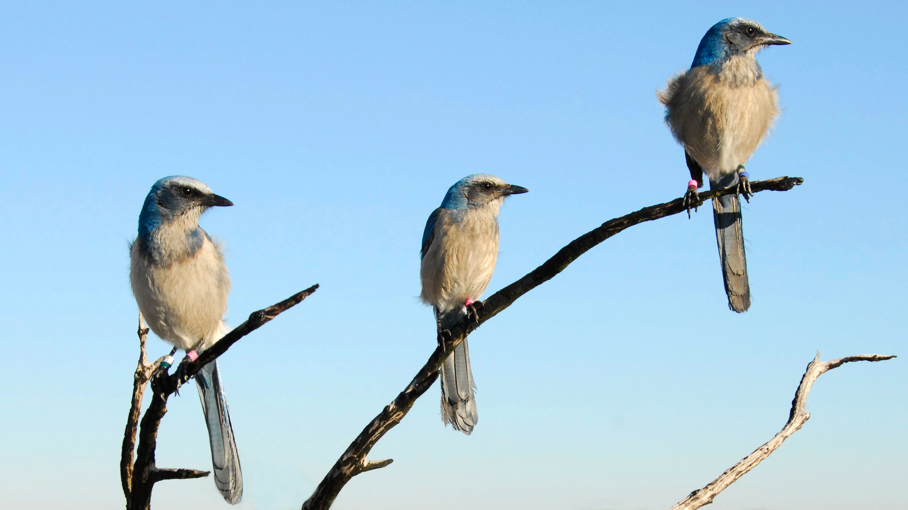
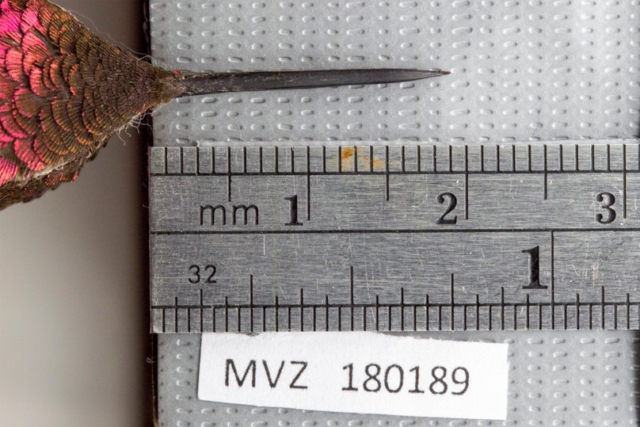

## Research interests

---

### The genetics of inbreeding depression

I’m broadly interested in using population genomics to better understand how inbreeding impacts the fitness of small, threatened populations. Specifically, I’m investigating the genetics of inbreeding depression in a population of [Florida Scrub-Jays](https://www.archbold-station.org/projects/long-term-florida-scrub-jay-project) at Archbold Biological Station. Some questions I'm exploring include: 
+ How does inbreeding manifest in the genome across individuals and over time?
+ What regions of the genome contribute to negative fitness outcomes (and ultimately, population decline) over short timescales? What role does deleterious variation play?
+ How can gene flow mitigate (or exacerbate) the effects of inbreeding depression at the genetic level? How can we use this knowledge to inform conservation management practices?

<i>Image credit: Reed Bowman</i>

---

### Hummingbirds and urbanization

During my undergraduate at UC Berkeley in [Noah Whiteman's lab](http://www.noahwhiteman.org/), I used museum specimens from the [Museum of Vertebrate Zoology](https://mvz.berkeley.edu/) to explore how the morphology of Anna’s Hummingbirds has responded to decades of anthropogenic environmental changes, such as the [introduction of hummingbird feeders](https://www.audubon.org/magazine/hummingbird-rapidly-evolved-longer-beak-slurp-more-nectar-feeders-new-study-finds).

<i>Image credit: Ian Edison</i>